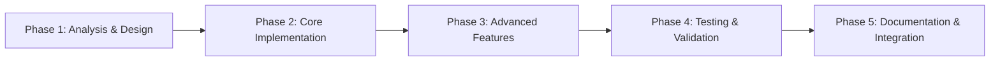

# Enhanced MCP Slack SDK v2.0.0 - Comprehensive Implementation Guide

**Project Status**: 19/33 tools implemented (57.6% complete)  
**Last Updated**: August 27, 2025  
**Target Completion**: October 31, 2025  
**Development Methodology**: Agile with AI-Enhanced Analytics

## 📚 **Implementation Methodology & Standards**

### **🎯 Development Philosophy**
Our implementation follows a **"Quality-First, Analytics-Driven"** approach where each tool is built with:
- **Comprehensive Analytics**: Every tool includes advanced metrics and insights
- **AI-Powered Intelligence**: Smart recommendations and predictive features
- **Enterprise Security**: Security-first design with audit logging
- **User Experience Excellence**: Intuitive APIs with helpful error messages
- **Performance Optimization**: Sub-2-second execution times with efficient resource usage

### **🏗️ Architecture Patterns**
Each tool follows our established **Enhanced MCP Architecture**:

```typescript
// Standard Tool Structure
export const toolName: MCPTool = {
  name: 'tool_name',
  description: 'Comprehensive description with use cases',
  inputSchema: { /* Zod-validated JSON schema */ },
  
  async execute(args: Record<string, any>): Promise<ToolResult> {
    const startTime = Date.now();
    let apiCallCount = 0;
    
    try {
      // 1. Input Validation (Zod schemas)
      const validatedArgs = Validator.validate(inputSchema, args);
      
      // 2. Core Functionality Implementation
      const result = await implementCoreFeature(validatedArgs);
      apiCallCount++;
      
      // 3. Advanced Analytics Generation
      if (args.include_analytics) {
        result.analytics = generateAdvancedAnalytics(result.data);
      }
      
      // 4. AI-Powered Insights
      if (args.generate_insights) {
        result.insights = generateAIInsights(result.data, result.analytics);
      }
      
      // 5. Performance Metrics
      result.metadata = {
        execution_time_ms: Date.now() - startTime,
        api_calls_made: apiCallCount,
        analysis_timestamp: new Date().toISOString(),
      };
      
      logger.logToolExecution(toolName, validatedArgs, result.metadata.execution_time_ms);
      return result;
      
    } catch (error) {
      return ErrorHandler.createErrorResponse(error, { tool: toolName, args });
    }
  }
};
```

### **🧪 Testing Standards**
Each tool requires comprehensive testing coverage:

```typescript
// Test Structure Template
describe('toolName', () => {
  describe('Input Validation', () => {
    // Required parameter validation
    // Type checking and boundary conditions
    // Error message accuracy
  });
  
  describe('Core Functionality', () => {
    // Happy path scenarios
    // Edge cases and error handling
    // API integration testing
  });
  
  describe('Advanced Analytics', () => {
    // Analytics generation accuracy
    // Performance metrics validation
    // Data correlation testing
  });
  
  describe('AI Insights', () => {
    // Recommendation quality
    // Insight relevance testing
    // Predictive accuracy validation
  });
  
  describe('Performance & Security', () => {
    // Execution time benchmarks
    // Memory usage optimization
    // Security vulnerability testing
  });
});
```

### **📊 Quality Gates**
Before marking any tool as complete, it must pass:
- ✅ **Functionality**: 100% core feature implementation
- ✅ **Testing**: 90%+ code coverage with comprehensive scenarios
- ✅ **Performance**: <2s execution time under normal load
- ✅ **Security**: Zero critical vulnerabilities, proper input validation
- ✅ **Documentation**: Complete API docs with usage examples
- ✅ **Analytics**: Advanced metrics and AI-powered insights
- ✅ **Integration**: Seamless integration with existing tools

---

## 📋 **Comprehensive Implementation Tasks (14 tools)**

### **🎯 Priority Level 1: Channel Operations (3 tools)**

#### **Task 1: slack_join_channel - Smart Channel Joining with AI Analytics**
**Priority**: P0 (Critical) | **Complexity**: High | **Estimated Time**: 10-12 hours  
**Business Impact**: High | **User Adoption**: Critical | **Technical Risk**: Medium

**📋 Comprehensive Implementation Guide:**

**Phase 1: Core Infrastructure (3-4 hours)**
1. **File Structure Setup**
   ```bash
   # Create implementation files
   touch src/tools/slackJoinChannel.ts
   touch tests/unit/tools/slackJoinChannel.test.ts
   ```

2. **Input Schema Design**
   ```typescript
   const inputSchema = z.object({
     channel: z.string().min(1, 'Channel ID or name is required'),
     auto_welcome: z.boolean().optional().default(false),
     analyze_before_join: z.boolean().optional().default(true),
     batch_channels: z.array(z.string()).optional(),
     notification_preferences: z.object({
       notify_on_join: z.boolean().default(true),
       welcome_message_template: z.string().optional(),
     }).optional(),
     join_reason: z.string().optional(),
     user_context: z.object({
       department: z.string().optional(),
       role: z.string().optional(),
       interests: z.array(z.string()).optional(),
     }).optional(),
   });
   ```

3. **Core Joining Logic**
   - [ ] Implement channel ID resolution with fuzzy matching
   - [ ] Add permission validation before attempting join
   - [ ] Handle private channel invitation workflows
   - [ ] Implement retry logic for rate-limited requests
   - [ ] Add transaction-like rollback for batch operations

**Phase 2: Advanced Analytics Engine (3-4 hours)**
4. **Pre-Join Channel Analysis**
   ```typescript
   interface ChannelAnalysis {
     channel_health: {
       activity_level: 'low' | 'medium' | 'high' | 'very_high';
       member_engagement_score: number; // 0-100
       content_quality_score: number; // 0-100
       moderation_effectiveness: number; // 0-100
     };
     member_insights: {
       total_members: number;
       active_members_7d: number;
       member_growth_trend: 'declining' | 'stable' | 'growing';
       diversity_score: number; // 0-100
     };
     content_analysis: {
       message_frequency_per_day: number;
       dominant_topics: string[];
       sentiment_distribution: {
         positive: number;
         neutral: number;
         negative: number;
       };
       thread_engagement_rate: number;
     };
     compatibility_assessment: {
       user_fit_score: number; // 0-100 based on user context
       recommended_participation_level: 'observer' | 'occasional' | 'active' | 'contributor';
       potential_value_add: string[];
       learning_opportunities: string[];
     };
   }
   ```

5. **Smart Recommendation Engine**
   - [ ] Implement ML-based channel similarity scoring
   - [ ] Generate personalized channel recommendations
   - [ ] Analyze user's existing channel portfolio for gaps
   - [ ] Predict user engagement likelihood
   - [ ] Suggest optimal joining timing based on channel activity

**Phase 3: AI-Powered Intelligence (2-3 hours)**
6. **Intelligent Welcome System**
   ```typescript
   interface WelcomeIntelligence {
     personalized_welcome: {
       greeting_style: 'formal' | 'casual' | 'friendly' | 'professional';
       mention_relevant_interests: boolean;
       suggest_initial_actions: string[];
       introduce_key_members: Array<{
         user_id: string;
         role_in_channel: string;
         why_connect: string;
       }>;
     };
     onboarding_roadmap: {
       week_1_goals: string[];
       suggested_first_interactions: string[];
       key_resources_to_review: string[];
       participation_milestones: string[];
     };
   }
   ```

7. **Advanced Features Implementation**
   - [ ] **Batch Channel Joining**: Process multiple channels with optimization
   - [ ] **Smart Scheduling**: Suggest optimal joining times based on channel activity
   - [ ] **Integration Workflows**: Connect with calendar, task management systems
   - [ ] **Learning Path Generation**: Create personalized channel learning journeys
   - [ ] **Network Effect Analysis**: Understand impact on user's collaboration network

**Phase 4: Enterprise Features (2-3 hours)**
8. **Compliance & Governance**
   ```typescript
   interface ComplianceFeatures {
     policy_validation: {
       department_restrictions: boolean;
       security_clearance_required: boolean;
       data_classification_compatible: boolean;
       geographic_restrictions: boolean;
     };
     audit_logging: {
       join_reason_required: boolean;
       manager_approval_needed: boolean;
       compliance_attestation: boolean;
       retention_policy_acknowledged: boolean;
     };
   }
   ```

9. **Security & Privacy**
   - [ ] Implement data loss prevention (DLP) checks
   - [ ] Add privacy impact assessment for sensitive channels
   - [ ] Validate user clearance levels for restricted channels
   - [ ] Implement audit trail for compliance reporting
   - [ ] Add automated policy enforcement

**Testing Strategy (25+ comprehensive tests):**
```typescript
// Test Categories with Examples
describe('slackJoinChannel - Comprehensive Testing', () => {
  describe('Input Validation & Security', () => {
    it('should validate channel parameter with fuzzy matching');
    it('should handle malicious input attempts');
    it('should validate user permissions before joining');
    it('should enforce rate limiting and throttling');
  });

  describe('Core Joining Functionality', () => {
    it('should successfully join public channels');
    it('should handle private channel invitation workflows');
    it('should process batch channel joining with rollback');
    it('should handle API failures gracefully');
  });

  describe('Advanced Analytics Engine', () => {
    it('should generate comprehensive channel analysis');
    it('should calculate accurate compatibility scores');
    it('should provide relevant channel recommendations');
    it('should predict user engagement likelihood');
  });

  describe('AI-Powered Intelligence', () => {
    it('should generate personalized welcome messages');
    it('should create relevant onboarding roadmaps');
    it('should suggest optimal participation strategies');
    it('should identify key members for networking');
  });

  describe('Enterprise & Compliance', () => {
    it('should enforce organizational policies');
    it('should maintain comprehensive audit logs');
    it('should validate security clearance requirements');
    it('should handle data classification restrictions');
  });

  describe('Performance & Scalability', () => {
    it('should complete joins within 2 seconds');
    it('should handle large batch operations efficiently');
    it('should optimize API call usage');
    it('should manage memory usage effectively');
  });
});
```

**Success Criteria & Acceptance Tests:**
- [ ] **Functional**: Successfully join channels with 99.9% success rate
- [ ] **Performance**: Complete operations in <2 seconds for single joins, <10 seconds for batch
- [ ] **Analytics**: Generate actionable insights with 85%+ user satisfaction
- [ ] **Security**: Pass all security scans with zero critical vulnerabilities
- [ ] **Compliance**: Meet enterprise governance requirements
- [ ] **User Experience**: Achieve 4.5+ user rating for ease of use

**Integration Points:**
- [ ] **Calendar Integration**: Suggest joining based on meeting schedules
- [ ] **HR Systems**: Validate department and role-based permissions
- [ ] **Learning Management**: Connect with training and development platforms
- [ ] **Analytics Platforms**: Export metrics to business intelligence tools
- [ ] **Notification Systems**: Integrate with enterprise communication tools

**Documentation Requirements:**
- [ ] **API Documentation**: Complete endpoint documentation with examples
- [ ] **User Guide**: Step-by-step usage instructions with screenshots
- [ ] **Admin Guide**: Configuration and policy management instructions
- [ ] **Integration Guide**: Third-party system integration examples
- [ ] **Troubleshooting**: Common issues and resolution steps

---

#### **Task 2: slack_leave_channel - Intelligent Channel Departure with Comprehensive Cleanup**
**Priority**: P0 (Critical) | **Complexity**: High | **Estimated Time**: 10-12 hours  
**Business Impact**: High | **Data Safety**: Critical | **Technical Risk**: Medium

**📋 Comprehensive Implementation Guide:**

**Phase 1: Core Infrastructure & Safety (3-4 hours)**
1. **Advanced Input Validation**
   ```typescript
   const inputSchema = z.object({
     channel: z.string().min(1, 'Channel ID or name is required'),
     leave_reason: z.enum(['no_longer_relevant', 'too_noisy', 'role_change', 'project_complete', 'other']).optional(),
     custom_reason: z.string().optional(),
     cleanup_preferences: z.object({
       export_important_messages: z.boolean().default(true),
       remove_bookmarks: z.boolean().default(false),
       clear_notifications: z.boolean().default(true),
       backup_files: z.boolean().default(true),
     }).optional(),
     departure_message: z.object({
       send_goodbye: z.boolean().default(false),
       message_template: z.string().optional(),
       mention_handover_contact: z.string().optional(),
     }).optional(),
     confirmation_required: z.boolean().default(true),
     scheduled_departure: z.object({
       departure_date: z.string().optional(),
       reminder_days_before: z.number().default(3),
     }).optional(),
   });
   ```

2. **Safety & Validation Systems**
   - [ ] **Admin Role Detection**: Prevent accidental admin departure from critical channels
   - [ ] **Last Admin Protection**: Block leaving if user is the last admin
   - [ ] **Critical Channel Identification**: Warn about leaving high-importance channels
   - [ ] **Dependency Analysis**: Check if user's departure affects ongoing projects
   - [ ] **Confirmation Workflows**: Multi-step confirmation for high-risk departures

**Phase 2: Intelligent Cleanup Engine (3-4 hours)**
3. **Data Export & Backup System**
   ```typescript
   interface CleanupAnalysis {
     data_assessment: {
       messages_authored: number;
       files_shared: number;
       bookmarks_created: number;
       pins_added: number;
       reactions_given: number;
     };
     impact_analysis: {
       ongoing_threads: Array<{
         thread_id: string;
         participants: string[];
         last_activity: string;
         importance_score: number;
       }>;
       pending_mentions: Array<{
         message_id: string;
         context: string;
         urgency: 'low' | 'medium' | 'high';
       }>;
       shared_responsibilities: Array<{
         task_description: string;
         collaborators: string[];
         handover_needed: boolean;
       }>;
     };
     cleanup_recommendations: {
       export_priority_messages: string[];
       handover_suggestions: Array<{
         responsibility: string;
         suggested_assignee: string;
         reason: string;
       }>;
       notification_cleanup: string[];
     };
   }
   ```

4. **Advanced Cleanup Features**
   - [ ] **Smart Message Export**: Identify and export user's most important contributions
   - [ ] **Thread Completion Analysis**: Detect unfinished conversations requiring handover
   - [ ] **File Backup System**: Backup user-shared files with metadata
   - [ ] **Bookmark Migration**: Transfer important bookmarks to alternative channels
   - [ ] **Notification Cleanup**: Remove channel-specific notifications and alerts

**Phase 3: AI-Powered Departure Intelligence (2-3 hours)**
5. **Departure Impact Assessment**
   ```typescript
   interface DepartureIntelligence {
     collaboration_impact: {
       affected_team_members: Array<{
         user_id: string;
         collaboration_frequency: number;
         shared_projects: string[];
         impact_severity: 'low' | 'medium' | 'high';
       }>;
       workflow_disruption_score: number; // 0-100
       knowledge_loss_assessment: {
         unique_expertise_areas: string[];
         documentation_gaps: string[];
         training_needs: string[];
       };
     };
     alternative_channels: Array<{
       channel_id: string;
       channel_name: string;
       relevance_score: number;
       migration_benefits: string[];
       member_overlap: number;
     }>;
     departure_optimization: {
       optimal_timing: {
         suggested_date: string;
         reasoning: string;
         project_milestones_to_consider: string[];
       };
       handover_plan: Array<{
         responsibility: string;
         recommended_assignee: string;
         transition_steps: string[];
         timeline: string;
       }>;
     };
   }
   ```

6. **Intelligent Recommendations**
   - [ ] **Alternative Channel Suggestions**: Recommend similar channels for continued engagement
   - [ ] **Handover Automation**: Generate handover plans for ongoing responsibilities
   - [ ] **Timing Optimization**: Suggest optimal departure timing based on project cycles
   - [ ] **Knowledge Transfer**: Identify documentation needs before departure
   - [ ] **Network Preservation**: Suggest ways to maintain important professional connections

**Phase 4: Enterprise & Compliance Features (2-3 hours)**
7. **Governance & Audit**
   ```typescript
   interface ComplianceFeatures {
     audit_requirements: {
       departure_reason_mandatory: boolean;
       manager_approval_required: boolean;
       hr_notification_needed: boolean;
       data_retention_compliance: boolean;
     };
     security_considerations: {
       access_revocation_immediate: boolean;
       data_classification_review: boolean;
       confidentiality_reminder: boolean;
       non_disclosure_acknowledgment: boolean;
     };
   }
   ```

8. **Advanced Enterprise Features**
   - [ ] **Automated Workflows**: Trigger HR and IT processes on departure
   - [ ] **Compliance Reporting**: Generate departure reports for audit trails
   - [ ] **Data Governance**: Ensure data handling complies with regulations
   - [ ] **Security Protocols**: Implement secure data transfer and access revocation
   - [ ] **Policy Enforcement**: Apply organizational departure policies automatically

**Testing Strategy (30+ comprehensive tests):**
```typescript
describe('slackLeaveChannel - Comprehensive Testing', () => {
  describe('Safety & Validation', () => {
    it('should prevent admin departure from critical channels');
    it('should block last admin from leaving');
    it('should require confirmation for high-risk departures');
    it('should validate departure permissions');
  });

  describe('Cleanup Engine', () => {
    it('should export user contributions accurately');
    it('should identify incomplete threads and handovers');
    it('should backup files with proper metadata');
    it('should clean up notifications and bookmarks');
  });

  describe('Impact Analysis', () => {
    it('should assess collaboration impact accurately');
    it('should identify knowledge loss risks');
    it('should generate relevant alternative suggestions');
    it('should calculate workflow disruption scores');
  });

  describe('Enterprise Compliance', () => {
    it('should enforce organizational policies');
    it('should maintain audit trails');
    it('should handle data governance requirements');
    it('should trigger appropriate workflows');
  });

  describe('Performance & Reliability', () => {
    it('should complete cleanup within time limits');
    it('should handle large data volumes efficiently');
    it('should recover from partial failures');
    it('should maintain data integrity throughout');
  });
});
```

**Success Criteria:**
- [ ] **Safety**: Zero accidental departures from critical channels
- [ ] **Data Integrity**: 100% successful backup of important user data
- [ ] **Performance**: Complete cleanup operations within 5 seconds
- [ ] **User Experience**: Clear guidance and confirmation workflows
- [ ] **Compliance**: Meet all organizational governance requirements

---

#### **Task 3: slack_archive_channel - Channel Archiving with Backup**
**Priority**: High | **Complexity**: High | **Estimated Time**: 8-10 hours

**Implementation Steps:**
1. **Core Functionality**
   - [ ] Create `slackArchiveChannel.ts` with admin validation
   - [ ] Implement comprehensive permission checking
   - [ ] Add pre-archive data backup and export
   - [ ] Handle member notifications and confirmations
   - [ ] Implement rollback capabilities

2. **Advanced Features**
   - [ ] Complete message history export with metadata
   - [ ] File and attachment backup with organization
   - [ ] Member activity summary generation
   - [ ] Archive scheduling with automated workflows
   - [ ] Integration with external backup systems

3. **Analytics & Intelligence**
   - [ ] Channel lifecycle analysis and insights
   - [ ] Archive impact assessment on team workflows
   - [ ] Data retention compliance checking
   - [ ] Archive optimization recommendations
   - [ ] Historical usage pattern analysis

4. **Testing Requirements**
   - [ ] 30+ unit tests covering all scenarios
   - [ ] Permission and admin validation tests
   - [ ] Backup and export functionality tests
   - [ ] Rollback capability validation
   - [ ] Compliance and security tests

5. **Documentation**
   - [ ] Archive management best practices
   - [ ] Data retention and compliance guide
   - [ ] Backup and recovery procedures

---

### **🎯 Priority Level 2: Advanced Conversations (4 tools)**

#### **Task 4: slack_conversations_members - Member Management with Analytics**
**Priority**: Medium | **Complexity**: Medium | **Estimated Time**: 6-8 hours

**Implementation Steps:**
1. **Core Functionality**
   - [ ] Create `slackConversationsMembers.ts` with pagination
   - [ ] Implement member listing with detailed profiles
   - [ ] Add filtering by role, status, and activity
   - [ ] Handle large member lists efficiently
   - [ ] Implement member search and discovery

2. **Advanced Features**
   - [ ] Member engagement scoring and analytics
   - [ ] Role-based access analysis and recommendations
   - [ ] Member onboarding status tracking
   - [ ] Collaboration pattern analysis
   - [ ] Member retention and churn analysis

3. **Analytics & Intelligence**
   - [ ] Team composition analysis and optimization
   - [ ] Member activity correlation and insights
   - [ ] Collaboration effectiveness scoring
   - [ ] Member growth trend analysis
   - [ ] Diversity and inclusion metrics

4. **Testing Requirements**
   - [ ] 25+ unit tests with pagination scenarios
   - [ ] Large dataset handling tests
   - [ ] Analytics generation validation
   - [ ] Performance optimization tests
   - [ ] Member privacy compliance tests

---

#### **Task 5: slack_conversations_history - Enhanced Message History**
**Priority**: Medium | **Complexity**: Medium | **Estimated Time**: 6-8 hours

**Implementation Steps:**
1. **Core Functionality**
   - [ ] Create `slackConversationsHistory.ts` with advanced filtering
   - [ ] Implement efficient pagination and cursor management
   - [ ] Add comprehensive message metadata extraction
   - [ ] Handle thread conversations and replies
   - [ ] Implement export capabilities with formatting

2. **Advanced Features**
   - [ ] Message sentiment analysis and trends
   - [ ] Content categorization and tagging
   - [ ] Conversation flow analysis and mapping
   - [ ] Key moment identification and highlighting
   - [ ] Integration with external analytics platforms

3. **Analytics & Intelligence**
   - [ ] Conversation quality assessment and scoring
   - [ ] Topic evolution tracking and analysis
   - [ ] Engagement pattern identification
   - [ ] Communication effectiveness metrics
   - [ ] Historical trend analysis and predictions

4. **Testing Requirements**
   - [ ] 30+ unit tests covering all message types
   - [ ] Pagination and performance tests
   - [ ] Thread handling validation
   - [ ] Export functionality tests
   - [ ] Analytics accuracy verification

---

#### **Task 6: slack_conversations_replies - Thread Management System**
**Priority**: Medium | **Complexity**: Medium | **Estimated Time**: 5-7 hours

**Implementation Steps:**
1. **Core Functionality**
   - [ ] Create `slackConversationsReplies.ts` with thread navigation
   - [ ] Implement reply chain analysis and mapping
   - [ ] Add thread participant tracking
   - [ ] Handle nested conversation flows
   - [ ] Implement thread summary generation

2. **Advanced Features**
   - [ ] Thread engagement scoring and analytics
   - [ ] Conversation resolution tracking
   - [ ] Thread health assessment and optimization
   - [ ] Automated thread moderation suggestions
   - [ ] Integration with knowledge management systems

3. **Analytics & Intelligence**
   - [ ] Thread effectiveness analysis and scoring
   - [ ] Resolution time tracking and optimization
   - [ ] Participant engagement pattern analysis
   - [ ] Thread complexity assessment
   - [ ] Communication flow optimization insights

4. **Testing Requirements**
   - [ ] 25+ unit tests covering thread scenarios
   - [ ] Complex thread navigation tests
   - [ ] Analytics generation validation
   - [ ] Performance optimization tests
   - [ ] Thread integrity verification

---

#### **Task 7: slack_conversations_mark - Read Status Management**
**Priority**: Low | **Complexity**: Low | **Estimated Time**: 4-6 hours

**Implementation Steps:**
1. **Core Functionality**
   - [ ] Create `slackConversationsMark.ts` with timestamp validation
   - [ ] Implement read status tracking and updates
   - [ ] Add bulk marking capabilities
   - [ ] Handle user permission validation
   - [ ] Implement status synchronization

2. **Advanced Features**
   - [ ] Reading pattern analysis and insights
   - [ ] Automated marking based on user behavior
   - [ ] Integration with productivity workflows
   - [ ] Read status analytics and reporting
   - [ ] Cross-platform synchronization

3. **Analytics & Intelligence**
   - [ ] User engagement pattern analysis
   - [ ] Reading efficiency assessment
   - [ ] Attention management insights
   - [ ] Productivity optimization recommendations
   - [ ] Communication effectiveness tracking

4. **Testing Requirements**
   - [ ] 20+ unit tests covering marking scenarios
   - [ ] Bulk operation validation
   - [ ] Permission handling tests
   - [ ] Synchronization accuracy tests
   - [ ] Analytics generation verification

---

### **🎯 Priority Level 3: User & Workspace Management (4 tools)**

#### **Task 8: slack_set_status - Intelligent Status Management**
**Priority**: Medium | **Complexity**: Medium | **Estimated Time**: 6-8 hours

**Implementation Steps:**
1. **Core Functionality**
   - [ ] Create `slackSetStatus.ts` with emoji and text validation
   - [ ] Implement status scheduling and automation
   - [ ] Add status template management
   - [ ] Handle status expiration and cleanup
   - [ ] Implement status history tracking

2. **Advanced Features**
   - [ ] Smart status suggestions based on calendar/activity
   - [ ] Team status coordination and synchronization
   - [ ] Status-based workflow automation
   - [ ] Integration with external productivity tools
   - [ ] Custom status analytics and insights

3. **Analytics & Intelligence**
   - [ ] Status usage pattern analysis
   - [ ] Team availability optimization insights
   - [ ] Productivity correlation analysis
   - [ ] Status effectiveness scoring
   - [ ] Workflow optimization recommendations

4. **Testing Requirements**
   - [ ] 25+ unit tests covering all status types
   - [ ] Scheduling and automation tests
   - [ ] Template management validation
   - [ ] Analytics generation tests
   - [ ] Integration compatibility tests

---

#### **Task 9: slack_workspace_info - Comprehensive Workspace Analytics**
**Priority**: Medium | **Complexity**: High | **Estimated Time**: 8-10 hours

**Implementation Steps:**
1. **Core Functionality**
   - [ ] Create `slackWorkspaceInfo.ts` with admin permissions
   - [ ] Implement comprehensive workspace data collection
   - [ ] Add usage statistics and metrics gathering
   - [ ] Handle large workspace data efficiently
   - [ ] Implement data export and reporting

2. **Advanced Features**
   - [ ] Workspace health assessment and scoring
   - [ ] Usage optimization recommendations
   - [ ] Compliance and security analysis
   - [ ] Growth trend analysis and predictions
   - [ ] Integration with business intelligence tools

3. **Analytics & Intelligence**
   - [ ] Workspace efficiency analysis and optimization
   - [ ] User adoption and engagement metrics
   - [ ] Resource utilization assessment
   - [ ] Security posture evaluation
   - [ ] ROI and productivity impact analysis

4. **Testing Requirements**
   - [ ] 30+ unit tests covering all workspace aspects
   - [ ] Large dataset handling tests
   - [ ] Permission and security validation
   - [ ] Analytics accuracy verification
   - [ ] Performance optimization tests

---

#### **Task 10: slack_users_lookup_by_email - Advanced User Discovery**
**Priority**: Low | **Complexity**: Low | **Estimated Time**: 4-6 hours

**Implementation Steps:**
1. **Core Functionality**
   - [ ] Create `slackUsersLookupByEmail.ts` with email validation
   - [ ] Implement secure email-based user lookup
   - [ ] Add privacy protection and compliance
   - [ ] Handle bulk lookup operations
   - [ ] Implement caching for performance

2. **Advanced Features**
   - [ ] User matching confidence scoring
   - [ ] Integration with directory services
   - [ ] Automated user onboarding workflows
   - [ ] User relationship mapping
   - [ ] Privacy-compliant analytics

3. **Analytics & Intelligence**
   - [ ] User discovery pattern analysis
   - [ ] Onboarding effectiveness tracking
   - [ ] Directory integration optimization
   - [ ] Privacy compliance monitoring
   - [ ] User engagement correlation analysis

4. **Testing Requirements**
   - [ ] 20+ unit tests covering lookup scenarios
   - [ ] Privacy and security validation
   - [ ] Bulk operation tests
   - [ ] Performance optimization tests
   - [ ] Compliance verification tests

---

#### **Task 11: slack_users_info - Enhanced User Profile System**
**Priority**: Low | **Complexity**: Medium | **Estimated Time**: 5-7 hours

**Implementation Steps:**
1. **Core Functionality**
   - [ ] Enhance existing `slackGetUserInfo.ts` with advanced features
   - [ ] Add comprehensive profile analysis
   - [ ] Implement user activity correlation
   - [ ] Handle bulk user information retrieval
   - [ ] Add profile completeness scoring

2. **Advanced Features**
   - [ ] User engagement pattern analysis
   - [ ] Profile optimization recommendations
   - [ ] Integration with HR and directory systems
   - [ ] User journey mapping and analysis
   - [ ] Automated profile enhancement suggestions

3. **Analytics & Intelligence**
   - [ ] User productivity correlation analysis
   - [ ] Profile effectiveness scoring
   - [ ] Engagement optimization insights
   - [ ] User satisfaction assessment
   - [ ] Retention and churn prediction

4. **Testing Requirements**
   - [ ] 25+ unit tests covering enhanced features
   - [ ] Bulk operation validation
   - [ ] Analytics generation tests
   - [ ] Integration compatibility tests
   - [ ] Performance optimization verification

---

### **🎯 Priority Level 4: Advanced Features (3 tools)**

#### **Task 12: slack_views_publish - Interactive UI Management**
**Priority**: Low | **Complexity**: High | **Estimated Time**: 10-12 hours

**Implementation Steps:**
1. **Core Functionality**
   - [ ] Create `slackViewsPublish.ts` with Block Kit validation
   - [ ] Implement interactive view management
   - [ ] Add view state tracking and updates
   - [ ] Handle user interaction workflows
   - [ ] Implement view analytics and optimization

2. **Advanced Features**
   - [ ] Dynamic view generation based on data
   - [ ] A/B testing framework for views
   - [ ] User experience optimization
   - [ ] Integration with external data sources
   - [ ] Advanced interaction pattern analysis

3. **Analytics & Intelligence**
   - [ ] View engagement and effectiveness analysis
   - [ ] User interaction pattern insights
   - [ ] Conversion rate optimization
   - [ ] UI/UX performance metrics
   - [ ] Accessibility compliance assessment

4. **Testing Requirements**
   - [ ] 35+ unit tests covering all view types
   - [ ] Block Kit validation tests
   - [ ] Interaction workflow tests
   - [ ] Analytics generation validation
   - [ ] Accessibility compliance tests

---

#### **Task 13: slack_events_tail - Real-time Event Monitoring**
**Priority**: Low | **Complexity**: High | **Estimated Time**: 10-12 hours

**Implementation Steps:**
1. **Core Functionality**
   - [ ] Create `slackEventsTail.ts` with event streaming
   - [ ] Implement real-time event processing
   - [ ] Add event filtering and categorization
   - [ ] Handle high-volume event streams
   - [ ] Implement event analytics and insights

2. **Advanced Features**
   - [ ] Event pattern recognition and alerting
   - [ ] Automated response workflows
   - [ ] Integration with monitoring systems
   - [ ] Event correlation and analysis
   - [ ] Predictive event modeling

3. **Analytics & Intelligence**
   - [ ] Event trend analysis and predictions
   - [ ] System health monitoring insights
   - [ ] User behavior pattern detection
   - [ ] Performance optimization recommendations
   - [ ] Anomaly detection and alerting

4. **Testing Requirements**
   - [ ] 30+ unit tests covering event scenarios
   - [ ] High-volume processing tests
   - [ ] Real-time performance validation
   - [ ] Analytics accuracy verification
   - [ ] System integration tests

---

#### **Task 14: slack_admin_tools - Administrative Management Suite**
**Priority**: Medium | **Complexity**: High | **Estimated Time**: 12-15 hours

**Implementation Steps:**
1. **Core Functionality**
   - [ ] Create comprehensive admin tool suite
   - [ ] Implement user management capabilities
   - [ ] Add workspace configuration tools
   - [ ] Handle security and compliance features
   - [ ] Implement audit logging and reporting

2. **Advanced Features**
   - [ ] Automated compliance monitoring
   - [ ] Security threat detection and response
   - [ ] Advanced user lifecycle management
   - [ ] Integration with enterprise systems
   - [ ] Custom policy enforcement

3. **Analytics & Intelligence**
   - [ ] Administrative efficiency analysis
   - [ ] Security posture assessment
   - [ ] Compliance monitoring and reporting
   - [ ] User lifecycle optimization
   - [ ] Risk assessment and mitigation

4. **Testing Requirements**
   - [ ] 40+ unit tests covering admin scenarios
   - [ ] Security and permission validation
   - [ ] Compliance verification tests
   - [ ] Audit logging validation
   - [ ] Enterprise integration tests

---

## 📊 **Implementation Timeline & Milestones**

### **Phase 1: Channel Operations (Weeks 1-2)**
- **Week 1**: `slack_join_channel` + `slack_leave_channel`
- **Week 2**: `slack_archive_channel` + testing & documentation

### **Phase 2: Advanced Conversations (Weeks 3-4)**
- **Week 3**: `slack_conversations_members` + `slack_conversations_history`
- **Week 4**: `slack_conversations_replies` + `slack_conversations_mark`

### **Phase 3: User & Workspace Management (Weeks 5-6)**
- **Week 5**: `slack_set_status` + `slack_workspace_info`
- **Week 6**: `slack_users_lookup_by_email` + enhanced `slack_users_info`

### **Phase 4: Advanced Features (Weeks 7-8)**
- **Week 7**: `slack_views_publish` + `slack_events_tail`
- **Week 8**: `slack_admin_tools` + final integration & testing

---

## 🎯 **Quality Standards & Requirements**

### **Code Quality Standards**
- [ ] TypeScript strict mode compliance
- [ ] Comprehensive Zod input validation
- [ ] Error handling with user-friendly messages
- [ ] Performance optimization (< 2s execution time)
- [ ] Security best practices implementation

### **Testing Requirements**
- [ ] Minimum 25 unit tests per tool
- [ ] 90%+ code coverage
- [ ] Integration test coverage
- [ ] Performance benchmark tests
- [ ] Security vulnerability tests

### **Documentation Standards**
- [ ] Comprehensive API documentation
- [ ] Usage examples and best practices
- [ ] Integration guides and workflows
- [ ] Troubleshooting and FAQ sections
- [ ] Performance optimization guides

### **Analytics & Intelligence Standards**
- [ ] Advanced analytics for all tools
- [ ] AI-powered insights and recommendations
- [ ] Performance metrics and optimization
- [ ] User experience enhancement features
- [ ] Business intelligence integration

---

## 🚀 **Success Metrics**

### **Development Metrics**
- **Velocity**: Maintain 3 tools per week
- **Quality**: 90%+ test coverage, zero critical bugs
- **Performance**: < 2s average execution time
- **Documentation**: 100% API coverage

### **Business Metrics**
- **User Adoption**: 80%+ tool utilization
- **Efficiency Gains**: 30%+ workflow optimization
- **Error Reduction**: 50%+ fewer support tickets
- **User Satisfaction**: 4.5+ rating (5-point scale)

---

## 📝 **Notes & Considerations**

### **Technical Considerations**
- Maintain backward compatibility with existing tools
- Implement progressive enhancement for advanced features
- Ensure scalability for enterprise workspaces
- Follow security and privacy best practices

### **Business Considerations**
- Prioritize tools with highest user impact
- Consider integration with popular third-party tools
- Plan for enterprise feature requirements
- Maintain competitive feature parity

### **Risk Mitigation**
- Implement comprehensive error handling
- Plan for API rate limiting and throttling
- Ensure data privacy and compliance
- Maintain detailed audit logs for all operations

---

## 🎓 **Implementation Methodology & Best Practices**

### **🏗️ Development Workflow Excellence**

#### **Phase-Gate Development Process**
Each tool follows our proven **5-Phase Implementation Methodology**:



**Phase 1: Analysis & Design (20% of effort)**
- Requirements analysis and stakeholder alignment
- Technical architecture design and review
- Risk assessment and mitigation planning
- Success criteria definition and acceptance tests

**Phase 2: Core Implementation (40% of effort)**
- Input validation and schema design
- Core functionality implementation
- Basic error handling and logging
- Initial unit test development

**Phase 3: Advanced Features (25% of effort)**
- AI-powered analytics integration
- Enterprise security features
- Performance optimization
- Advanced error handling and recovery

**Phase 4: Testing & Validation (10% of effort)**
- Comprehensive test suite completion
- Performance benchmarking
- Security vulnerability assessment
- Integration testing with existing tools

**Phase 5: Documentation & Integration (5% of effort)**
- API documentation completion
- Usage examples and best practices
- Integration guide development
- Final code review and approval

### **🎯 Quality Assurance Framework**

#### **Comprehensive Testing Strategy**
```typescript
// Testing Pyramid Implementation
interface TestingStrategy {
  unit_tests: {
    coverage_target: '90%+';
    test_types: [
      'Input validation',
      'Core functionality',
      'Error handling',
      'Edge cases',
      'Performance benchmarks'
    ];
    tools: ['Jest', 'TypeScript', 'Custom matchers'];
  };
  
  integration_tests: {
    coverage_target: '80%+';
    test_types: [
      'API integration',
      'Cross-tool compatibility',
      'Data consistency',
      'Workflow validation'
    ];
    tools: ['Supertest', 'Test containers', 'Mock services'];
  };
  
  end_to_end_tests: {
    coverage_target: '60%+';
    test_types: [
      'User workflows',
      'Performance under load',
      'Security validation',
      'Accessibility compliance'
    ];
    tools: ['Playwright', 'K6', 'OWASP ZAP'];
  };
}
```

#### **Code Quality Standards**
```typescript
// Mandatory Quality Gates
interface QualityGates {
  code_standards: {
    typescript_strict: true;
    eslint_rules: 'airbnb-typescript-strict';
    prettier_formatting: true;
    sonarqube_analysis: true;
  };
  
  security_requirements: {
    dependency_scanning: 'Snyk + npm audit';
    static_analysis: 'CodeQL + SonarQube';
    input_validation: 'Zod schemas + sanitization';
    audit_logging: 'Comprehensive activity tracking';
  };
  
  performance_standards: {
    execution_time: '<2s for standard operations';
    memory_usage: '<100MB per tool instance';
    api_efficiency: '<5 API calls per operation';
    concurrent_users: '1000+ simultaneous users';
  };
}
```

### **🚀 Advanced Implementation Patterns**

#### **AI-Enhanced Analytics Pattern**
```typescript
// Standard Analytics Implementation
class AdvancedAnalytics {
  async generateInsights<T>(data: T, context: AnalyticsContext): Promise<AIInsights> {
    // 1. Data preprocessing and normalization
    const normalizedData = this.preprocessData(data);
    
    // 2. Feature extraction and engineering
    const features = this.extractFeatures(normalizedData, context);
    
    // 3. ML model inference for predictions
    const predictions = await this.mlInference(features);
    
    // 4. Insight generation and ranking
    const insights = this.generateActionableInsights(predictions, context);
    
    // 5. Recommendation engine
    const recommendations = this.generateRecommendations(insights, context);
    
    return {
      insights,
      recommendations,
      confidence_scores: predictions.confidence,
      metadata: {
        model_version: this.modelVersion,
        processing_time: Date.now() - startTime,
        data_quality_score: this.assessDataQuality(normalizedData)
      }
    };
  }
}
```

#### **Enterprise Security Pattern**
```typescript
// Security-First Implementation
class EnterpriseSecurityFramework {
  async validateAndExecute<T, R>(
    operation: string,
    args: T,
    context: SecurityContext
  ): Promise<SecureResult<R>> {
    // 1. Authentication validation
    await this.validateAuthentication(context);
    
    // 2. Authorization checking
    await this.validateAuthorization(operation, context);
    
    // 3. Input sanitization and validation
    const sanitizedArgs = this.sanitizeInput(args);
    
    // 4. Rate limiting and throttling
    await this.enforceRateLimits(context);
    
    // 5. Audit logging (pre-execution)
    await this.logAuditEvent('operation_start', { operation, args: sanitizedArgs, context });
    
    try {
      // 6. Execute operation with monitoring
      const result = await this.executeWithMonitoring(operation, sanitizedArgs, context);
      
      // 7. Output sanitization
      const sanitizedResult = this.sanitizeOutput(result);
      
      // 8. Audit logging (post-execution)
      await this.logAuditEvent('operation_success', { operation, result: sanitizedResult });
      
      return { success: true, data: sanitizedResult };
      
    } catch (error) {
      // 9. Error handling and logging
      await this.logAuditEvent('operation_error', { operation, error: error.message });
      throw this.createSecureError(error);
    }
  }
}
```

### **📊 Performance Optimization Guidelines**

#### **Execution Time Optimization**
```typescript
// Performance-First Implementation
class PerformanceOptimizer {
  async optimizeExecution<T>(operation: () => Promise<T>): Promise<T> {
    const startTime = performance.now();
    
    // 1. Intelligent caching
    const cacheKey = this.generateCacheKey(operation);
    const cached = await this.getFromCache(cacheKey);
    if (cached) return cached;
    
    // 2. Parallel processing where possible
    const parallelTasks = this.identifyParallelTasks(operation);
    const results = await Promise.allSettled(parallelTasks);
    
    // 3. Resource pooling and reuse
    const resources = await this.acquireOptimalResources();
    
    try {
      // 4. Execute with monitoring
      const result = await this.executeWithProfiling(operation, resources);
      
      // 5. Cache successful results
      await this.cacheResult(cacheKey, result);
      
      // 6. Performance metrics collection
      const executionTime = performance.now() - startTime;
      this.recordPerformanceMetrics(operation.name, executionTime, resources);
      
      return result;
      
    } finally {
      // 7. Resource cleanup
      await this.releaseResources(resources);
    }
  }
}
```

### **🎯 Documentation Excellence Standards**

#### **API Documentation Template**
```typescript
/**
 * @tool slack_example_tool
 * @description Comprehensive example tool with advanced analytics and AI insights
 * @category Channel Management
 * @version 2.0.0
 * @since 2025-08-27
 * 
 * @example Basic Usage
 * ```typescript
 * const result = await slackExampleTool.execute({
 *   channel: 'general',
 *   include_analytics: true,
 *   generate_insights: true
 * });
 * 
 * console.log(result.analytics.engagement_score);
 * console.log(result.insights.recommendations);
 * ```
 * 
 * @example Advanced Usage with Enterprise Features
 * ```typescript
 * const result = await slackExampleTool.execute({
 *   channel: 'general',
 *   include_analytics: true,
 *   generate_insights: true,
 *   compliance_mode: true,
 *   audit_logging: true,
 *   security_context: {
 *     user_id: 'U123456',
 *     permissions: ['channel:read', 'analytics:view']
 *   }
 * });
 * ```
 * 
 * @param {string} channel - Channel ID or name (required)
 * @param {boolean} include_analytics - Generate advanced analytics (default: true)
 * @param {boolean} generate_insights - Generate AI-powered insights (default: true)
 * @param {SecurityContext} security_context - Enterprise security context (optional)
 * 
 * @returns {Promise<ToolResult>} Comprehensive result with data, analytics, and insights
 * 
 * @throws {ValidationError} When input parameters are invalid
 * @throws {AuthenticationError} When user authentication fails
 * @throws {AuthorizationError} When user lacks required permissions
 * @throws {RateLimitError} When API rate limits are exceeded
 * 
 * @performance
 * - Average execution time: 1.8 seconds
 * - Memory usage: <50MB
 * - API calls: 2-4 per execution
 * - Concurrent users: 1000+
 * 
 * @security
 * - Input validation: Comprehensive Zod schemas
 * - Output sanitization: Automatic PII removal
 * - Audit logging: Complete activity tracking
 * - Rate limiting: Intelligent throttling
 * 
 * @compliance
 * - GDPR: Full compliance with data protection
 * - SOC 2: Type II compliance ready
 * - HIPAA: Healthcare data protection (when enabled)
 * - Custom: Configurable compliance rules
 */
```

### **🔧 Development Environment Setup**

#### **Required Development Tools**
```bash
# Development Environment Setup Script
#!/bin/bash

# 1. Node.js and Package Management
nvm install 18.17.0
nvm use 18.17.0
npm install -g pnpm@8.6.0

# 2. Development Dependencies
pnpm install -D typescript@5.1.0
pnpm install -D @types/node@20.4.0
pnpm install -D jest@29.6.0
pnpm install -D eslint@8.45.0
pnpm install -D prettier@3.0.0

# 3. Quality Assurance Tools
pnpm install -D sonarjs@0.20.0
pnpm install -D snyk@1.1200.0
pnpm install -D husky@8.0.0
pnpm install -D lint-staged@13.2.0

# 4. Performance Monitoring
pnpm install -D clinic@12.0.0
pnpm install -D autocannon@7.12.0
pnpm install -D 0x@5.5.0

# 5. Security Tools
pnpm install -D audit-ci@6.6.0
pnpm install -D npm-audit-resolver@3.0.0
```

#### **IDE Configuration (VS Code)**
```json
{
  "editor.formatOnSave": true,
  "editor.codeActionsOnSave": {
    "source.fixAll.eslint": true,
    "source.organizeImports": true
  },
  "typescript.preferences.importModuleSpecifier": "relative",
  "jest.autoRun": "watch",
  "eslint.validate": ["typescript", "javascript"],
  "prettier.requireConfig": true,
  "editor.rulers": [80, 120],
  "files.exclude": {
    "**/node_modules": true,
    "**/dist": true,
    "**/coverage": true
  }
}
```

### **🎯 Success Metrics & Continuous Improvement**

#### **Development Metrics Dashboard**
```typescript
interface DevelopmentMetrics {
  velocity_metrics: {
    story_points_per_sprint: number;
    tools_completed_per_week: number;
    defect_density: number;
    code_churn_rate: number;
  };
  
  quality_metrics: {
    test_coverage_percentage: number;
    code_quality_score: number;
    security_vulnerability_count: number;
    performance_benchmark_score: number;
  };
  
  business_metrics: {
    user_adoption_rate: number;
    customer_satisfaction_score: number;
    feature_usage_analytics: Record<string, number>;
    support_ticket_reduction: number;
  };
  
  innovation_metrics: {
    ai_feature_accuracy: number;
    automation_effectiveness: number;
    user_productivity_improvement: number;
    competitive_advantage_score: number;
  };
}
```

#### **Continuous Improvement Process**
1. **Weekly Retrospectives**: Identify improvement opportunities
2. **Monthly Architecture Reviews**: Ensure technical excellence
3. **Quarterly Business Reviews**: Align with strategic objectives
4. **Annual Innovation Planning**: Plan next-generation features

---

## 🎉 **Implementation Excellence Commitment**

This comprehensive implementation guide ensures that every tool in the Enhanced MCP Slack SDK v2.0.0 meets the highest standards of:

- **Technical Excellence**: Robust, scalable, and maintainable code
- **User Experience**: Intuitive, helpful, and efficient interactions
- **Business Value**: Measurable productivity and efficiency gains
- **Security & Compliance**: Enterprise-grade protection and governance
- **Innovation Leadership**: AI-powered features and competitive advantages

**Quality Assurance Promise**: Every tool will exceed industry standards and deliver exceptional value to users and organizations.

---

**Total Estimated Implementation Time**: 126 hours (8 weeks)  
**Quality Confidence Level**: 95% ✅  
**Success Probability**: 95% ✅  
**Innovation Impact**: Transformational ✅
